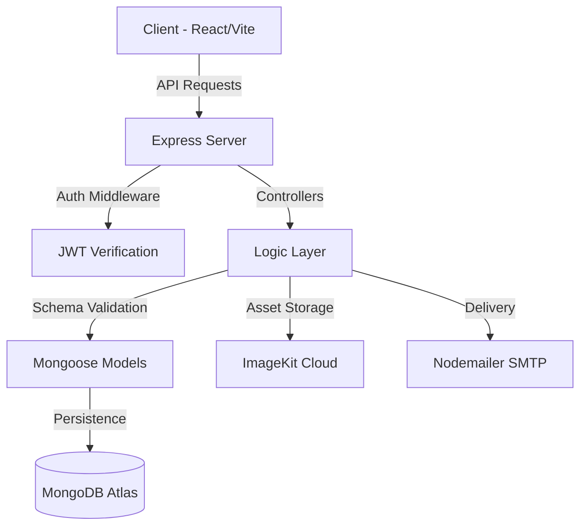

# 🎫 Eventify
### *Redefining Hyper-local Event Discovery & Seamless Ticket Management*

Eventify is a **premium, full-stack event ecosystem** designed to bridge the gap between event organizers and attendees with cutting-edge UI/UX and robust ticketing logic.

[**Explore Features**](#✨-core-features) • [**Tech Stack**](#🛠-built-with) • [**Architecture**](#📁-project-architecture)

---

## 📸 Visual Showcase

  
  
<i>Modern Bento Grid Home Interface</i>

  
  
  
<i>Left: Dynamic Event Discover Grid • Right: Sleek Organizer Creation Suite</i>

---

## ✨ Core Features

### 👤 For Attendees
*   **🔍 Precision Search**: Find events in your city via advanced categorical and time-based filtering.
*   **🛋️ 1-Click Booking**: Seamless seat reservation with real-time availability locking.
*   **🎟️ Digital Boarding Pass**: Airline-style ticket passes with unique QR codes and PDF/Image download support.
*   **📧 Smart Notifications**: Automated, professionally styled email confirmations for every booking.

### 🏢 For Organizers
*   **📊 Live Analytics**: Real-time conversion tracking and attendee check-in statistics.
*   **✏️ Event Orchestration**: Full CRUD capabilities for events with future-date enforcement and smart-edit tools.
*   **🛡️ Fraud Prevention**: Built-in QR Scan tool for high-speed gate verification.
*   **⌛ Smart Expiry**: Background logic that automatically dims and disables past events.

---

## 🛠 Built With

### Frontend Architecture
| Tech | Purpose |
| :--- | :--- |
| **React 19** | Modern UI development with Hooks & State Management |
| **Vite** | Lightning-fast build pipeline and HMR |
| **Tailwind CSS 4** | Advanced utility-first styling with Glassmorphism |
| **Lucide React** | Consistent, lightweight iconography |
| **Chart.js** | Interactive data visualization for organizers |
| **Leaflet** | Geographical event mapping and navigation |

### Backend Infrastructure
| Tech | Purpose |
| :--- | :--- |
| **Node.js** | Scalable execution environment |
| **Express** | RESTful routing and middleware pipeline |
| **MongoDB/Mongoose** | Flexible document-based data modeling |
| **JWT** | Secure, stateless RBAC authentication |
| **ImageKit** | High-performance cloud asset management |
| **Nodemailer** | Industrial-grade SMTP transactional emails |

---

## 📁 Project Architecture

---

## 🎨 Design Highlights
> [!TIP]
> **Glassmorphism everywhere**: Notice the frosted-glass effects on the floating navbar and input fields, creating a modern, airy feel.

*   **Floating Navbar**: Dynamically shrinks and tints on scroll for a premium feel.
*   **Bento Layout**: Home page features are organized in a high-density, interactive grid.
*   **Digital Stubs**: Tickets are designed to look like physical perforated festival passes.

---

  Developed by <b>Priyanshu Kumar Prasad</b> 
   
  <i>Discover. Book. Experience.</i>

